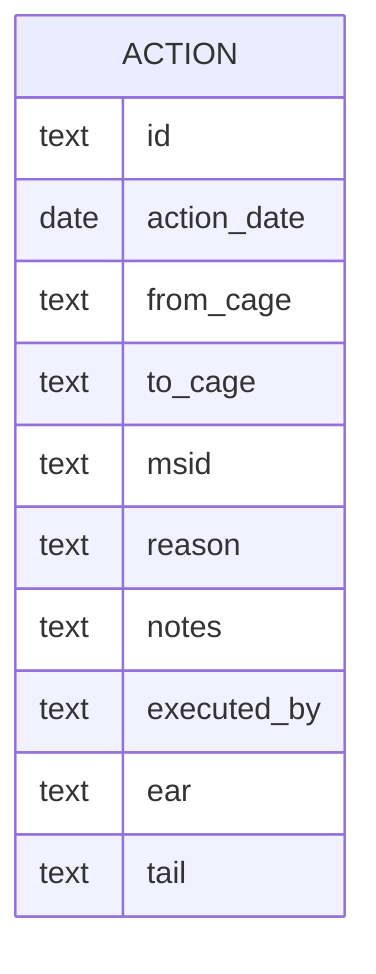
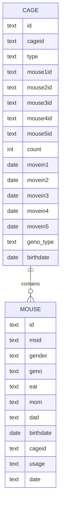

## Actions

The action table will be used to record action on daily bases.

Where the possible values of Cage.type are
1. pair(breeding)
2. male
3. female 

the Cage.birthdate only for breeding cage.