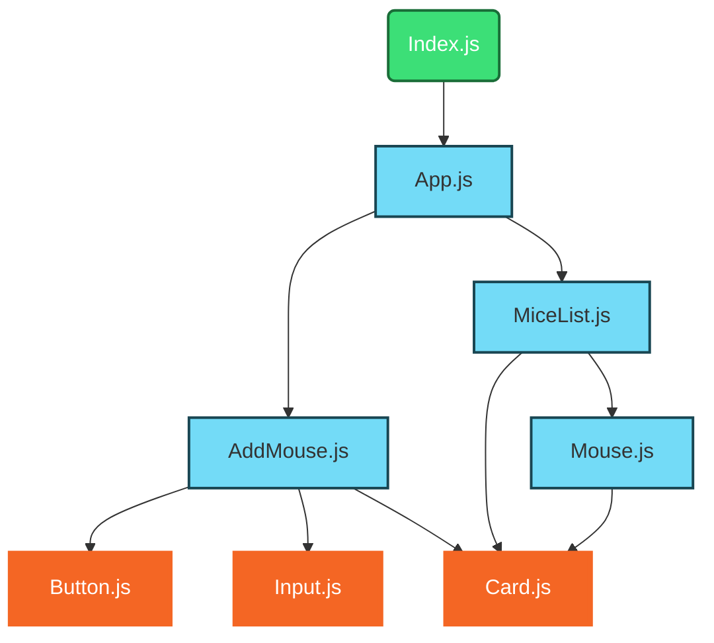
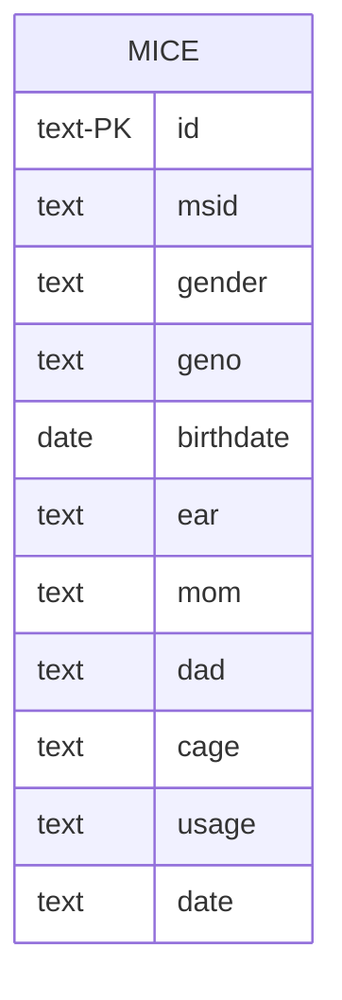
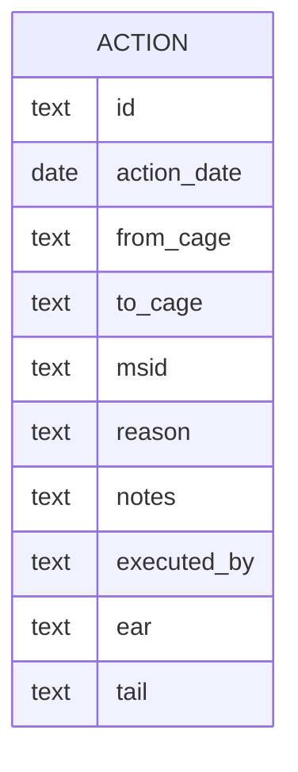
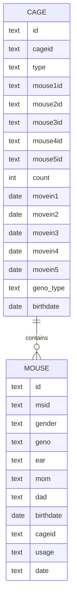
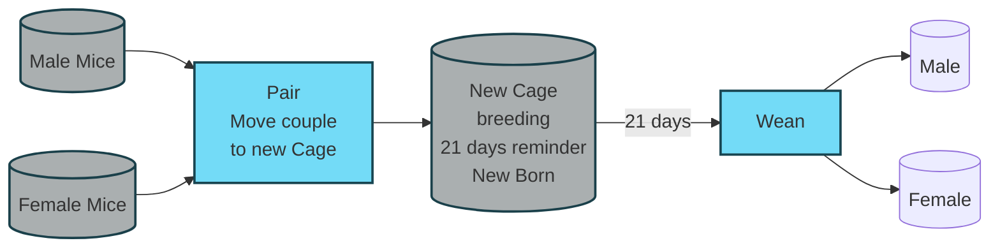
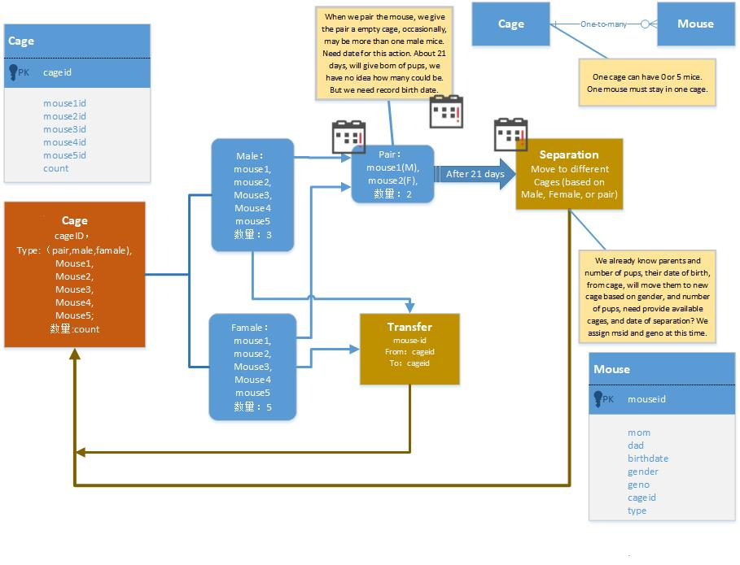
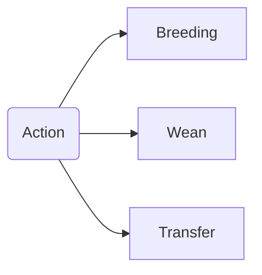
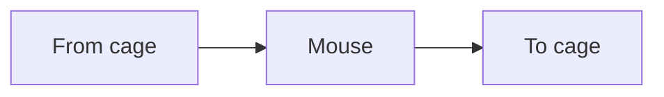
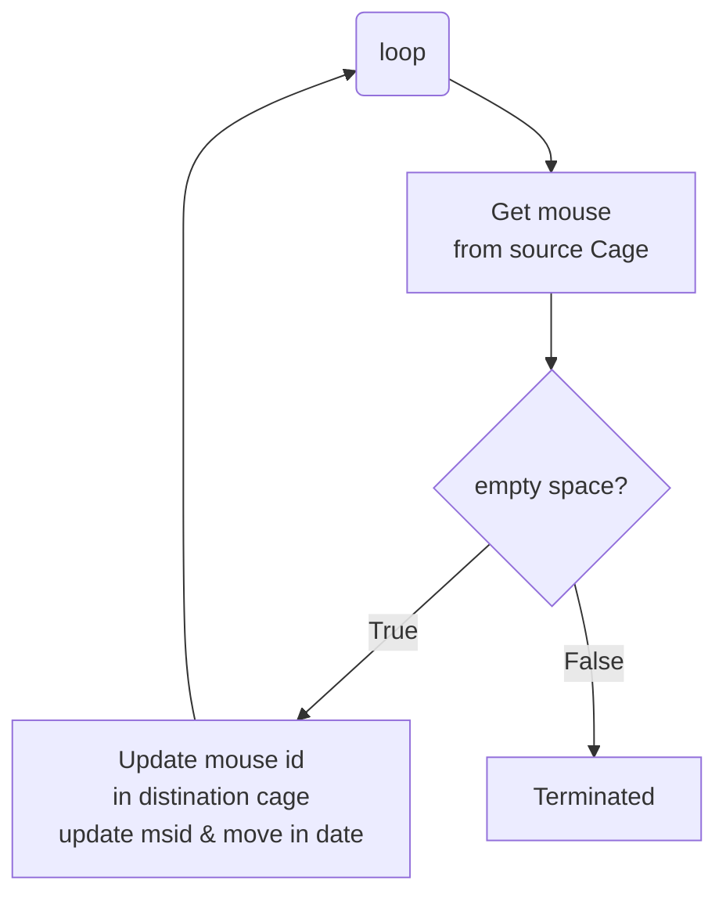

<h1>Mice Project Dev. Notes</h1>

[Markdown Utilities](../../doc/utilities.md)

[Build a react firebase application](https://www.youtube.com/watch?v=VqgTr-nd7Cg)

## Getting Started

### create a react project mice

```doc
C:\Users\12818\workspace\react-app>npx create-react-app mice
```

* in case we need create table ourselves
  
```sql
CREATE TABLE "mice" (
	"id"	TEXT NOT NULL,
	"MS_ID"	TEXT NOT NULL,
	"gender"	TEXT,
	"geno"	TEXT,
	"D.O.B"	DATE,
	"ear"	TEXT,
	"mom"	TEXT,
	"dad"	TEXT,
	"cage"	TEXT,
	"user"	TEXT,
	"date"	TEXT,
	PRIMARY KEY("id")
);
```
### File Structure

```dos 
mice
    ├── data/
    |       ├── Mice list-29210806.xls
    |       └── micelist.csv
    ├── doc/
    |       ├── mice.md (development notes)
    |       └── requirement.md 
    ├── public/
    |       └── index.html
    ├── 🔥src/
    |       ├── components/
    |       |       ├── UI/
    |       |       |   ├── Button.js
    |       |       |   ├── Input.js
    |       |       |   └── Card.js
    |       |       └── Mice/
    |       |           ├── AddMice.js
    |       |           ├── Mouse.js
    |       |           └── MiceList.js
    |       ├── index.js
    |       └── App.js
    ├── package.json
    └── 👉ReadMe.md
```

* Build Sqlite Database
* [Original data](../data/Mice%20list-20210806.xlsx)
* [Simplified csv data](../data/micelist.csv)

👎😢 **Issues**: date of birth change to number!

✔️😄 **Solution:**
> 1. highlight the data from original Excel spreadsheet; copy to clip board
> 2. past it to second line in new sheet with first(second) paste selection;
> 3. highlight colored fields ⟶ right-click ⟶ Format cells... ⟶ No Color ⟶ OK
> 4. add all column headers.

### create mice database


* [Python program to insert data to database](../data/insertMice.py)

## GUI Design



* in order to use @Material Table, install the following modules

✔️😄 Good for "react": "^17.0.2",

```dos
✔️😄 npm install @mui/material 
✔️😄 npm install @emotion/react 
✔️😄 npm install @emotion/styled
✔️😄 npm install @mui/icons-material
✔️😄 npm install @mui/x-data-grid
✔️😄 npm install datatables
--legacy-peer-deps
```

* [Main entry](../src/App.js) 👉[modiry](index.js)
* [Load data from DB, return MiceList](../src/components/Mice.js)
* [use MUIDataTable display mice list with filter, search, print, ...](../src/components/MiceList.js)
[Document about MUIDataTable](https://www.npmjs.com/package/mui-datatables)

* [We may not need this function AddMouse, instead using pair](../src/components/mice/AddMouse.js)

🔔⚡️ **Issue:**

```dos
SelectInput.js:444 
        
       MUI: You have provided an out-of-range value `undefined` for the select (name="cageID") component.
Consider providing a value that matches one of the available options or ''.
The available values are `A06`, `A08`, `A11`, `A03`, `A12`, `WB4`.
```

✔️😄 **Solution:** assign a default value.

```js Select.js
<Dropdown name="cageID" label="Cage ID" value={availableCages[0]} options={availableCages} />&nbsp;
```

## Mice


## Actions



The action table will be used to record action on daily bases.

## Cage



Where the possible values of Cage.type are
1. pair(breeding)
2. male
3. female 

the Cage.birthdate only for breeding cage.

## pair operation





## Update cages on action

It is possible that there already some mice in the same cage.





