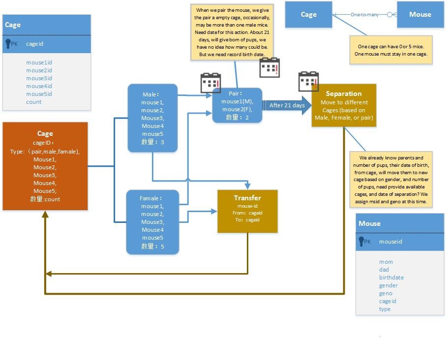
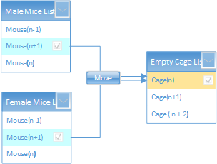
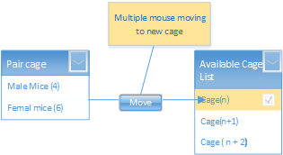
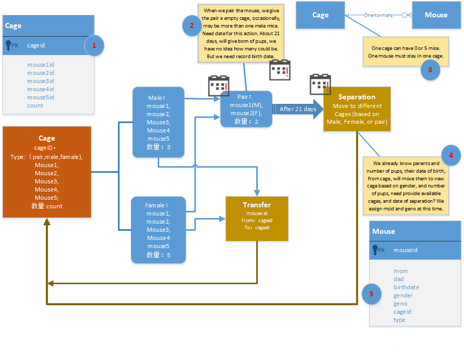
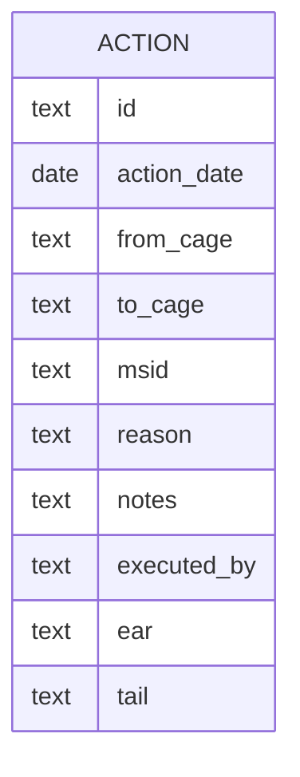
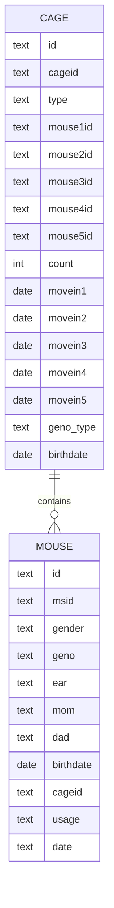

<h1>Mice Project Requirement</h1>

## get data from DB and display on the screen
Create a sqlite database, get data from Excel file, and save the data into DB.

## add new mouse record to DB
add Form for creating new mouse recode into DB.

## find mouse by msid

From 李翔
我说的这个报告其实无所谓什么格式，因为我们之前都是手写，基本上就是类似于这种
7/9/22
1. Move 7239-7254 out of TEB2 to 5xT13(M) and 1xT15(F)
这种是wean breeding pair
2. Kill 5424 5427 5458-60
这种是处死
3. 6427 dead 7/6/22
这种是发现已经死亡的
4. Move 5425-26 (LL LR) from W23 to W3
这是合笼，不过虽然我写了，但是我还没想好怎么标这里的耳洞才好，因为我日常手写都是每一只老鼠标记变化的，像是L→LL, R→LR。
5. Yunting moved E4x5 E8x3 E11x4 to Exp. 22-4, HAD 4wks + luciferin i. p. injection / wk, 7/9-8/9/22
这是使用老鼠做实验的
6. Move 5728 to WB3 for breeding. 
这里需要generate一下breeding pair,，我还不知道你们怎么标记这个呢
7. Cut tails 7426-7468 for genotype 
这是剪尾巴做PCR好确定基因型，这个报告的麻烦是部分崽子还在breeding cage里面，但是他们的老鼠号已经generate了，我不确定我们是应该把这种pups单独放着还是直接放到老鼠的总表里面去，只是标记笼号为breeding cage 的笼号
8. Vet move 5424 out of T23 to T23+ for fighting wound
或者Vet mark 5427 for teeth treatment 
这种是兽医的处理或者要求什么的

其实我不能保证啊，主管上我是不会编重号的。只不过万一重号了，我会把一些改成别的号码啊。而且有时候老鼠从妈妈肚子里出来了以后，我先编号，等着做完了genotype才会知道不是我以为的爸爸的，而是另外一个的，也得重新编号

我的理解是7235-7254是两只配对的老鼠.
不是哒，这是生出来的pups要分笼了。一般breeding pair指的是一公一母，一次性可能会生1-13只pups，理论上如果一对老鼠一直在一个笼子里面，最快每21天要生产一次，所以到差不多21天的时候我们就要看看母鼠有没有怀孕，如果有，就要不超过21天分笼，就是把小老鼠分出去。我是希望这个软件可以19-21天的时候提示一下要分笼了

那么TEB2是什么呢？是cage吗？
T和E是我的一种老鼠基因型，后面带B结尾的都是breeding cage。所以这个实际上是我的Tie2 和 Ezh2 两种老鼠的杂交breeding cage

cage的名称是固定的吗？有多少的不同？如果多，我们可以给cage制作一个数据库，和老鼠链接起来，这样你就可以随时掌握哪个cage里住的哪几个鼠，也可以掌握哪个鼠住哪个cage。
我们老鼠是在动物房统一饲养的，那边提供一种塔状老鼠饲养笼。你可以想像一下，上下一共十层，每层相当于一个pizza，均分成十分🍕，老鼠笼就是这种三角形的塑料盒子，可以方便的抽出来。所以每个笼子其实有两个号码，一个是我给的，一个是架子上的位置编号。只不过因为我常常给老鼠换位置，比如说把同一个实验的老鼠抽出来放到一起。所以架子编号我基本上不用，只用我自己给老鼠笼子编的号

这种笼子固定只能装不超过5只老鼠，按笼按天收费，所以我会经常把2-3只的笼子合并成一笼五只，老鼠换笼子比较常见，不过您说的“随时掌握哪个cage里住的哪几个鼠，也可以掌握哪个鼠住哪个cage。”我觉得非常好，我好想要，这样我整理笼子的时候可以很方便的把不足五只的笼子拼起来

## Design a Daily action DB
[design of DB table for daily action](actions.xlsx)

mouse_id is actually unique and serves the same purpose as id

geno is irrelevant

ear is which ear my parents punched a hole into to identify the living mice against each other since there are 5 mice in a cage and they look identical

mom and dad use Ms_id

cage is cage

user/usage is what the mice is being used for

date means when this mouse should or has died

add navigation bar :) [navigationbarexample](../../myreact/src/App9.js)

the actions.xlsx should be a *small* summary of the actions

design a report for all of the possible actions

create breeding system to add mice in large quantities.

| Field   | How to fill    |
| ------- | -------------- |
| id      | uuid           |
| dob     | onAdding       |
| cage    | onAdding       |
| mom     | autofill(cage) |
| dad     | autofill(cage) |
| born    | after          |
| males   | after          |
| females | after          |
| deaths  | after          |
| notes   | after          |

startid is inferred (the largest msid + 1) in the db , ❓ create maxid table in data, is it right?❓

👎😢 **Problem:** using largest msid may cause issues. 
1. the field must be an integer, not like "A1234";
2. if more than one user try to grab the max number, will cause duplication.
3. that's why noadays, people use uuid which will never get duplicated.

❓ What is the begining letter before the number of msid? how many different letters combination?

❓ to generate breeding table with out number of mice borned, how can we add those mice into mice table? which number corresponding to which mouse?

## Generate pdf report

* [Generate pdf by python]()
  
in the db

she told me that the letter in front of the msid was the type

since we have the type, the letter is useless

only one person should be able to edit the data and everyone else is a reader

size of columns in micelist and cagelist should be adjustable

王老师，我刚刚看了一下，我上个礼拜提出来的要求基本上还差很多啊。
1. 我没有看到我的breeding pair的list，无论是在mice list里面单独标注，让我可以提出来，还是单独给我一个list，我需要能够看到。因为我需要随时调整这个配对的，不能单独列出来，我很不方便
2. breeding的history也没有看到
3. 我跟张宏楷说了new pups我想能过从breeding history批量转入mice list，现在好像还是让我一只只的输入，这个太麻烦了
4. report好像还没有做完啊，我给你们的Excel文件里面有一个sub sheet叫做summary，你可以看看我需要总结一些什么
5.Cages那个页面是想总结现有的老鼠吗？没太看懂。不过我觉得这个想法是可以的，有待完成

我跟张宏楷说过了，批量输入需要不少的默认输入，比如说我从breeding history里面点某一条，选择这一次的老鼠分笼，那就应该直接给我跳转到cages这个部分，默认生日和父母，老鼠号应该是默认这个gene型的最新的号码，笼子号最好能给出现有的空笼子号码给我选择，或者从小到大排序

我现在觉得最难的是给你们解释清楚我想要什么啊

我跟张宏楷说了他好像也不太明白的样子，我不知道怎么跟他解释了。就像上面的那个批量输入，我跟他解释了两遍，他好像还是不明白

这个不行的，因为breeding的过程中间，有的妈妈生了13只pups，但是不可能养活这么多的，很多时候可能到分笼就剩下不到10只了

而且刚刚生下来其实是要跟着父母一段时间的，要吃奶啊

我跟张宏楷说了，breeding的记录其实分几个时间段，首先是breeding pair的建立，这个我几乎每个月都要换一些，我没看到你们放在哪里了

然后，顺利的。情况下呢，大概最少要21天才能生下第一次pups，这个时候记录的是new born，只需要记录出生日期还有breeding cage，以及大概有几只。这个时候我们其实不能开笼子，所以有几只老鼠都是估计的

第三次是再21天以后，这个时候我们就要把里面之前生出来的小pups分出来，让他们单独生活，这个时候分出来就是五只一笼了，而且还要分公母，因为如果顺利的话，妈妈已经怀孕，马上要生下一波pups了

这个时候的分笼记录的是wean，就是说小崽子们已经不需要吃奶了，可以自己吃粮自己生活了

很多pairs这个时候，同时还要记录下一波的出生，又是新的new born记录

在这里就是我刚才跟你说的批量处理，我就希望能够直接把这边的记录转到老鼠的list里面去，因为它的出生日期呀，父母啊这些都是固定的，我只需要把它默认的最新的老鼠号确定下来，然后确定每只老鼠到了哪个笼子里面去就可以了，这之后的genotype肯定只能手动输入，就没必要在这边折腾了。对了，在电脑上打开的时候，我能够一次性从excel file里面copy过来什么data吗？比如我的genotype结果

老鼠毕竟跟计算机还是不一样的，因为我有好几种老鼠，它从八周以后才能开始生孩子，然后生到六个月的时候就不能生了，所以有的老鼠我四周左右就开始放到一起去，期待他们八九周的时候就开始能生了，因为怀孕要21天。然后到了五六个月的时候，我就要放上新的pair，准备接着他继续往下生，所以这个其实换代的很快的

这也是你为什么看到我有的老鼠后面会标一个breeding，那个就是做的是后备的可能用于breeding pair的

而这也是为什么我的breeding pair的老鼠一定要单独列出来，我需要随时看到他的年龄以及他的生育记录，太老的或者两个月都没有生孩子的，我就需要马上要kill掉了

❓ pair的夫妻关系是固定的还是会重新配对？
> 那得看是哪一种老鼠，有的母老鼠只让它和某种公老鼠生一次，就得换别的公的老鼠，有的就是固定几个月，一直用到不能用为止

还有一种情况就是，一对老鼠两个月生不出来，如果母老鼠年龄还小，就会给他配一个新的公老鼠一起生

❓ 母鼠产子后与之配对的公鼠还待在同一只笼子里？还是移到别的笼子？
> 看情况，通常来说公鼠在笼子里面的小鼠长得比较好，如果公老鼠不在的话，那这一轮出来不超过六只老鼠小成活, 但是如果我已经不准备让这个breeding pair继续生下去的话，那我就会把公老鼠在三天之后移出来。

🛠🎯 **To do:**
1. create cages table based on design:
cageid, mouse1id, mouse2id, mouse3id, mouse4id, mouse5id, date1, date2, date3, date4, date5, count.
2. pull real data from mice to cages.
3. allow user add new cage just by input a cageid.
4. create **pair** action from male and female pair to new cage (allow more males).

5. create **separate** action from pair cage to available cages
   - assign mouseid, geno, gender, cageid to known parents, birthdate, from cage
   - update the old cage information, such as how many mice still in the cage...
  

6. create **transfer** action from one cage to another due to some reason(fight, experiment, ...)

7. create 21 days reminder action.
 

## Cage ID
我的几个字母是固定的，包括老鼠号前面的字母，breeding cage 除了最后的B，以及笼子号前面的字母都是一样的，表示gene型
A   ASM
J   Nlrp3
W  WT (B6.129, C57 BL/6J and C57 BL/6NJ)
N Nlrp3 flox
L Alb Cre
S SRB1
Y EYFP
F Ezh2 flox
M Myh11 constitutive Cre
R Myh11 inducible Cre
T Tie2 Cre
U UTX flox 
P RBP2 flox

1. 不太明白这个pk什么意思

2. breeding一共需要三种时间记录，公母放到一起的时间（pair），pups出生的时间（born），pups分笼的时间（wean）。pair以后不是一定21天born，只是可能，如果超过一段时间没有born，大概45-60天，就要提醒换pair或者处死了。born之后14天最好能提醒一下要剪尾巴做genotype，21天最好提醒一下要分笼。这里说一句，你们准备怎么处理这个时间提示啊？如果APP可以每天自动提醒我什么时间到了，我会方便很多。然后我有没有地方能够记录一下，我预估某一对pair可能快要生孩子了，需要常常检查，然后每天提醒我去看看他们生了没有

3. 一笼可以有0-5只老鼠，少于5只的，在我分笼的时候，请给我提示可以放老鼠进去，最好能同时告诉我里面已经有几只了

4. 我不一定能够这个时候assign老鼠的genotype结果，因为这个不是天天做的，得等我积累到一定数量才一起做。这里问一下，我做完了以后，做数据总结的时候是用Excel的，然后我可以一次性把Excel的一列结果贴过来吗？

5. 不光是这里，我没看到你提老鼠耳洞的事情，这个是非常重要的，一笼五只老鼠，基本上只能靠耳洞来区别他们，当然有时候我也会用毛色或者尾巴来区别，但是主要是耳洞。这个地方顺便说一句，万一某次分笼的时候，比如说，两种不同gene型的老鼠正好公的最后剩下的几只凑一块不多于五只，我也是可能把它们凑到一笼的，毕竟要等genotype的结果出来了再重新分笼

❓ when move the mouse, what are possible concerns?
>✔️
老鼠move的时候，我需要考虑很多事情，比如老鼠的genotype，我需要按照实验需要配对，这个我觉得你们可能没法给我提示，所以我只希望能给我一个地方标识一下，我准备把哪个老鼠move到哪个笼子里面，然后到了动物房照做就行了

## Cage
id
cageid
type(pair, male, female)
mouse1id
mouse2id
mouse3id
mouse4id
mouse5id
count
movein1
movein2
movein3
movein4
movein5
geno_type
notes

### sample cage pair data (breeding)
3134f349f0abcd
A04
pair
A2357(M)
A3412(F)
null
null
null
2
2022-01-15
2022-01-13
null
null
null
ASM

### sample Male data
3134f349f0abcd
A06
male
A2357
A3412
A2342
A3413
null
4
2022-01-15
2022-01-13
2022-01-15
2022-01-15
null
ASM

## Actions

The action table will be used to record action on daily bases.

Where the possible values of Cage.type are
1. pair(breeding)
2. male
3. female 

the Cage.bir

这种已经处死了的老鼠，我怎么才可以让它隐藏起来

pair这里，我怎么才能选择，比如说ASM的老鼠我要选genotype是+/-的老鼠，这里好像不能选
以及如果我希望remove所有的group的老鼠，我应该怎么隐藏,我不是说删除，而是暂时踢出pair的候选项

wean这里，我没有办法选择单独某一笼老鼠，或者某一只母鼠，查看她的生育记录，我甚至没办法选择某一种gene型的老鼠来查看
而且这里的选择好像没什么用，我以为选择某个生育记录，就表示我要给这一笼分笼？

我有尝试使用这个分笼，from cage这个空不让我写字，但是也不让我分笼，点击了没有反应

✔️the app could just be an addon of sort for Excel

✔️the app would read and filter the data

it could count the mice and sort the mice
> Sort the mice into groups 
> week 0 - 4 is past 4 weeks (from today)
> Count mice within each group
> I don't think we actually need to sort the mice, only count them

reminders

reports

✔️add data through her phones

highlighting

## BORN HISTORY

1. user look at table based on mom's ID
2. user be able to modify some other fields except mom's id, dad's id, cage